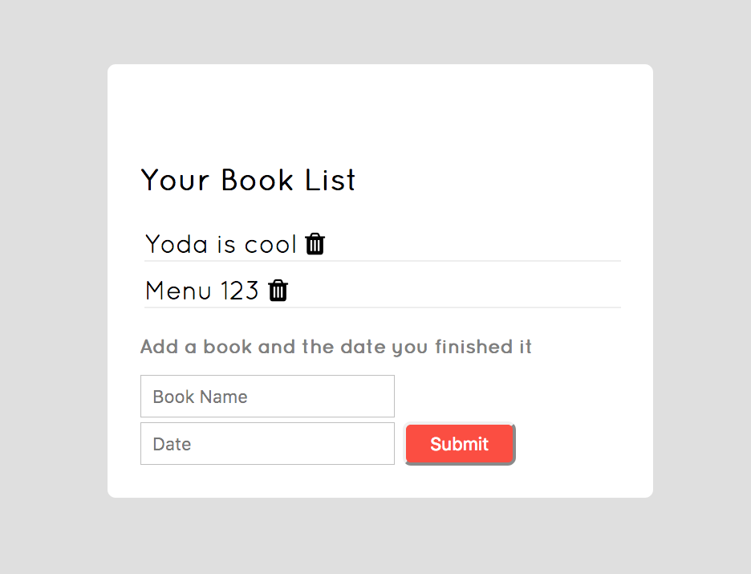

# Personal Book List

This handy component allows you to add the title and date you finished reading a book

**Link to project:** https://myraha.github.io/Personal-Express-Book/

## How It's Made:

**Tech used:** HTML, CSS, JavaScript, Node.js, Express, MongoDB

The index.ejs file connects your inputs to the server and database. Once you submit your data it is stored in the db and allows you to recall that information anytime you are using this app. The trash feature (functionality found in main.js) grabs the title and date for each specific line and deletes that object in the database.

## Lessons Learned:

Made a few interesting mistakes with the projects, thanks to that I learned how to:
Select specific lines to remove instead of empty areas. Confirm changes made through the database
Iterate through a database collection. Still need to fix margins and typography.
